# Project 3: SQL Data Analysis

*DecodeLabs Data Analytics Internship*

Dataset: E-commerce orders (1,200 rows) — OrderID, Date, CustomerID, Product, Quantity, UnitPrice, ShippingAddress, PaymentMethod, OrderStatus, TrackingNumber, ItemsInCart, CouponCode, ReferralSource, TotalPrice

Tool: Microsoft SQL Server 2022 / SSMS

Prepared by: Blessing Oshoke

## 1. Objective

Use SQL SELECT, WHERE, GROUP BY, HAVING, ORDER BY and aggregate functions (COUNT, SUM, AVG) to extract actionable business insights from the e-commerce orders dataset.

## 2. Queries, Results & Insights

### 1. Basic SELECT: View All Columns

```sql
-- Basic SELECT: view all columns
SELECT TOP 10 * FROM Dataset_for_Data_Analytics;
```

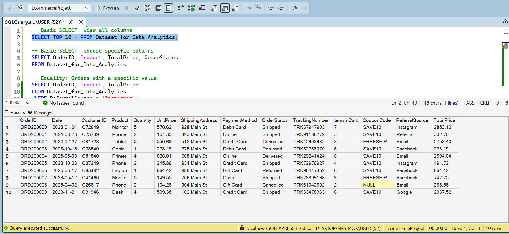

**Insight:** A first look at all 14 columns confirms the dataset is clean and ready to query, no obvious formatting issues across OrderID, Date, CustomerID, and the rest, aside from the odd expected NULL in CouponCode for orders that didn't use one.

### 2. Basic SELECT: Choose Specific Columns

```sql
-- Basic SELECT: choose specific columns
SELECT OrderID, Product, TotalPrice, OrderStatus
FROM Dataset_for_Data_Analytics;
```

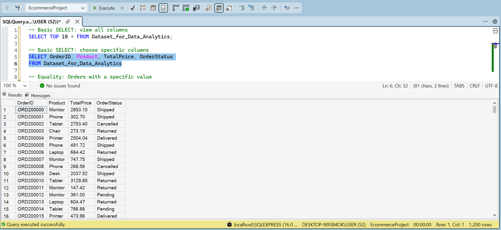

**Insight:** Narrowing to just the columns needed for order-level analysis (Product, TotalPrice, OrderStatus) across all 1,200 rows sets up a cleaner base for the filtering and aggregation queries that follow.

### 3. WHERE: Equality Filter

```sql
-- Equality: Orders with a specific value
SELECT OrderID, Product, TotalPrice
FROM Dataset_for_Data_Analytics
WHERE ReferralSource = 'Instagram';
```

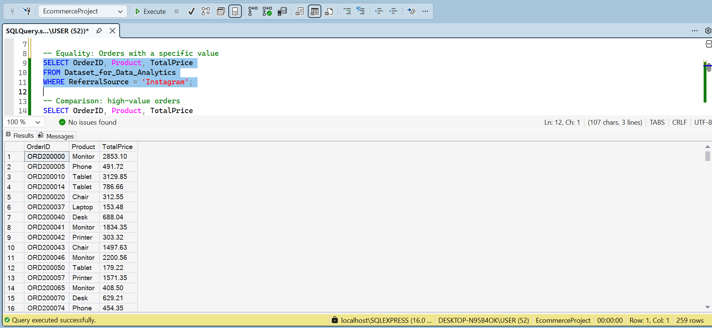

**Insight:** Instagram is the single largest referral channel by volume: 259 of 1,200 orders (about 22%) came through it.

### 4. WHERE: Comparison Filter

```sql
-- Comparison: high-value orders
SELECT OrderID, Product, TotalPrice
FROM Dataset_for_Data_Analytics
WHERE TotalPrice >= 2000;
```

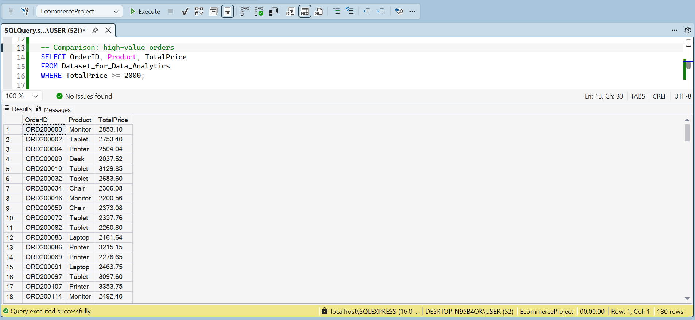

**Insight:** 180 orders (15% of all orders) are high-value at $2,000+ each, a natural segment to flag for a VIP/high-value customer group.

### 5. WHERE: Pattern Matching

```sql
-- Pattern Matching: all tracking numbers
SELECT OrderID, TrackingNumber
FROM Dataset_for_Data_Analytics
WHERE TrackingNumber LIKE 'TRK9%';
```

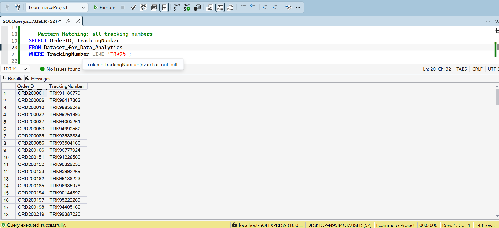

**Insight:** The LIKE operator with a wildcard correctly isolates the 143 tracking numbers that start with 'TRK9', confirming pattern matching works as expected on this column.

### 6. GROUP BY: COUNT()

```sql
-- Number of Orders per Product
SELECT Product, COUNT(*) AS OrderCount
FROM Dataset_for_Data_Analytics
GROUP BY Product
ORDER BY OrderCount DESC;
```

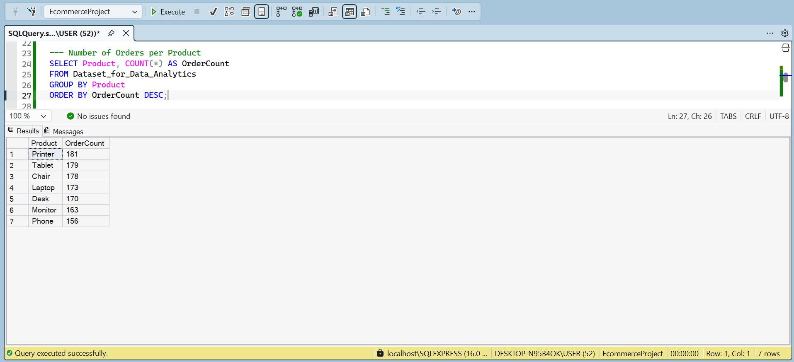

**Insight:** Order volume is fairly even across the catalog: Printer leads with 181 orders, Phone trails with 156, only a 25-order spread top to bottom.

### 7. GROUP BY: SUM()

```sql
-- Total revenue per product
SELECT Product, SUM(TotalPrice) AS TotalRevenue
FROM Dataset_for_Data_Analytics
GROUP BY Product
ORDER BY TotalRevenue DESC;
```

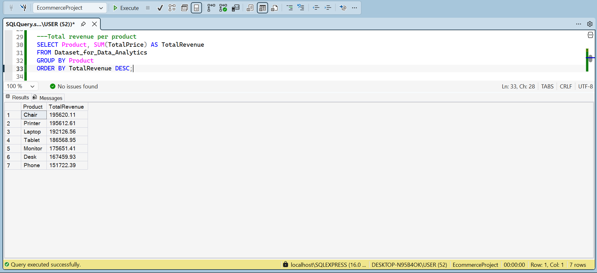

**Insight:** Chair earns the most total revenue ($195,620) despite Printer having more orders, meaning Chairs average order value is higher.

### 8. GROUP BY: AVG()

```sql
-- Average order value per payment method
SELECT PaymentMethod, AVG(TotalPrice) AS AvgOrderValue
FROM Dataset_for_Data_Analytics
GROUP BY PaymentMethod
ORDER BY AvgOrderValue DESC;
```

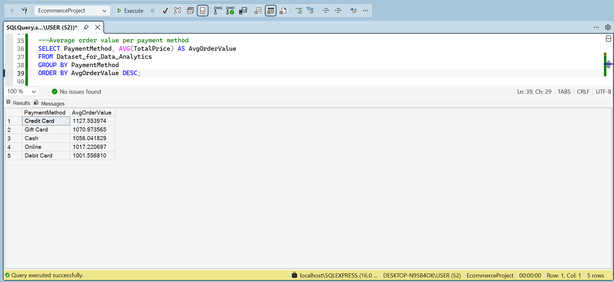

**Insight:** Credit Card customers spend the most per order on average ($1,127.55), about $126 more than Debit Card customers, the lowest at $1,001.56.

### 9. GROUP BY: Two Columns

```sql
-- Order status breakdown per referral source
SELECT ReferralSource, OrderStatus, COUNT(*) AS Orders
FROM Dataset_for_Data_Analytics
GROUP BY ReferralSource, OrderStatus
ORDER BY ReferralSource, Orders DESC;
```

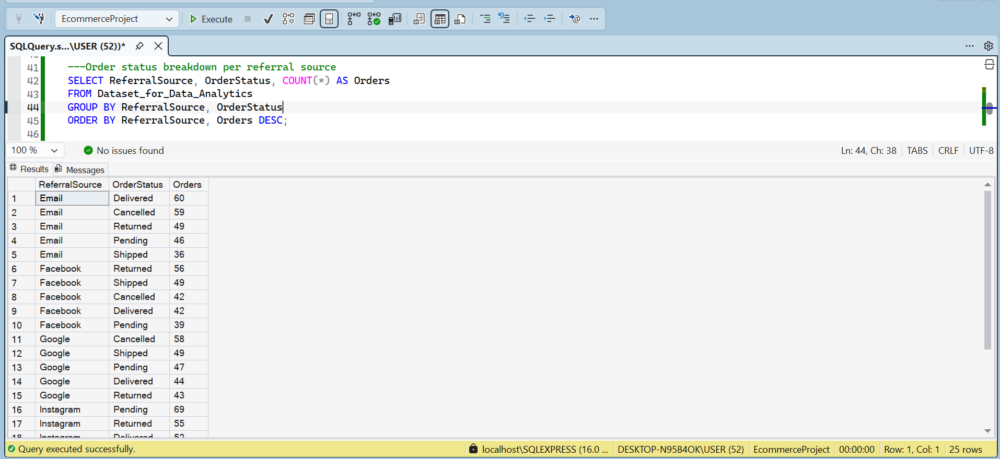

**Insight:** Breaking volume down by both channel and status shows each source has a broadly similar spread of outcomes e.g. Email is almost split evenly between Delivered (60) and Cancelled (59).

### 10. HAVING: Filtering Aggregated Results

```sql
-- Products with total revenue over 180,000
SELECT Product, SUM(TotalPrice) AS TotalRevenue
FROM Dataset_for_Data_Analytics
GROUP BY Product
HAVING SUM(TotalPrice) > 180000
ORDER BY TotalRevenue DESC;
```

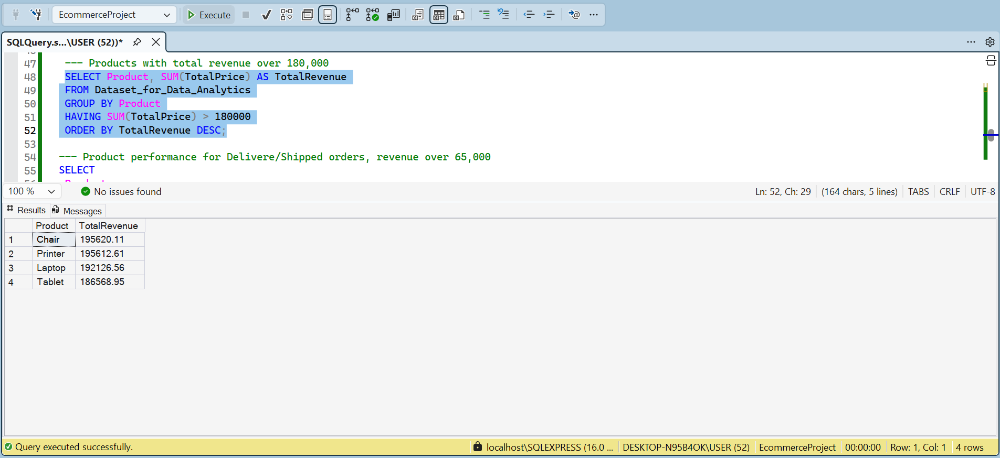

**Insight:** Only four products clear the $180,000 revenue mark. Chair, Printer, Laptop, and Tablet; a shortlist of 'top performers' for reporting.

### 11. Combined WHERE + GROUP BY + HAVING

```sql
-- Product performance for Delivered/Shipped orders, revenue over 65,000
SELECT
    Product,
    COUNT(*) AS OrderCount,
    SUM(TotalPrice) AS TotalRevenue,
    AVG(TotalPrice) AS AvgOrderValue
FROM Dataset_for_Data_Analytics
WHERE OrderStatus IN ('Delivered', 'Shipped')
GROUP BY Product
HAVING SUM(TotalPrice) > 65000
ORDER BY TotalRevenue DESC;
```

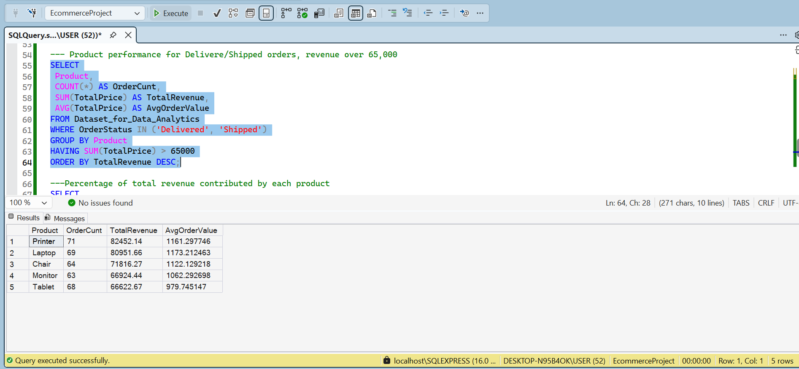

**Insight:** Even when the analysis is narrowed to only completed deliveries (excluding cancelled/returned orders), Printer stays the top performer by revenue.  A more reliable signal

### 12. Subquery: Percentage of Total Revenue

```sql
-- Percentage of total revenue contributed by each product
SELECT
    Product,
    SUM(TotalPrice) AS ProductRevenue,
    SUM(TotalPrice) * 100.0 / (SELECT SUM(TotalPrice) FROM Dataset_for_Data_Analytics) AS PercentOfTotal
FROM Dataset_for_Data_Analytics
GROUP BY Product
ORDER BY PercentOfTotal DESC;
```

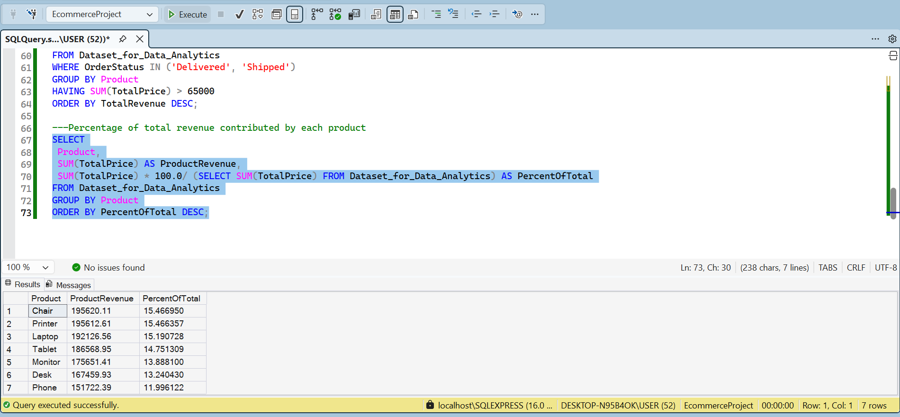

**Insight:** No single product dominates revenue. The top three (Chair, Printer, Laptop) combine for under 46% of total revenue, showing the business isn't overexposed to one product.

## 3. Key Takeaways

- Order volume is evenly spread across products, but revenue is not. Chairs convert higher-value orders more consistently than Printers despite fewer orders.
- Credit Card is the highest-spending payment method per order; Debit Card is the lowest.
- Instagram drives the most referral traffic, but order-status outcomes (Delivered/Cancelled/Returned) are similar across all channels. The traffic source doesn't appear to affect fulfillment success.
- Revenue is well-diversified across the catalog: no product accounts for more than 15.5% of total revenue.
- Filtering to only completed (Delivered/Shipped) orders confirms Printer, Laptop, and Chair remain the strongest performers even after removing cancelled/returned noise.
- 
